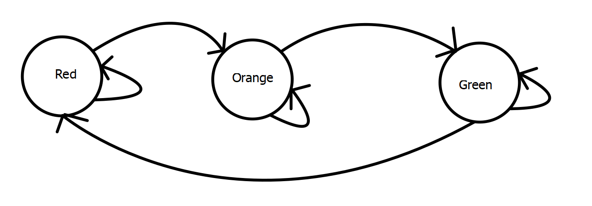

# 0105-traffic-light

> NOTA: Questo esempio non contiene né il monitor né il SUV. Serve solo per introdurre l'argomento.

Il nostro primo step è quello di modellare gli stati del semaforo. Un semaforo può avere tre stati:

- Red
- Orange
- Green

Da green vado in orange e da orange vado in red, da red vado in green. In ogni stato rimango per un certo tempo e poi passo allo stato successivo.
Per modellare gli stati posso creare un tipo enumerativo, vedi [types.mo](types.mo). Avrei potuto anche utilizzare gli interi direttamente, ma così è più leggibile.

Possiamo immaginare il semaforo come un automa, dobbiamo ora definire la **funzione di transizione**, vedi [next.mo](next.mo), che preso in input lo stato corrente restituisce lo stato successivo.

