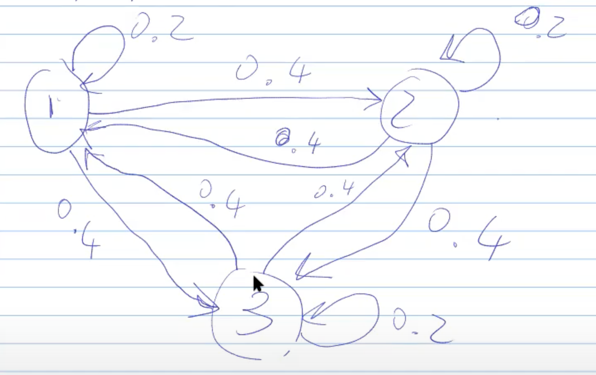

# 1100-markov-chains

Un esempio di catena di Markov è la seguente matrice:

$$
A=
\begin{bmatrix}
0.2 & 0.4 & 0.4 \\
0.4 & 0.2 & 0.4 \\
0.4 & 0.4 & 0.2
\end{bmatrix}
$$

Una catena di Markov è un automa a stati finiti, sugli archi ho una probabilità. **La somma delle probabilità sugli archi uscenti è 1**. La probabilità indica la probabilità di passare dallo stato in cui mi trovo a quello stato.

> Anche le frecce che mi fanno rimanere nello stesso stato sono considerate archi uscenti.

Quindi ad esempio ho una probabilità di 0.4 di passare dallo stato 1 allo stato 2, e così via.

Dentro **mc.mo** possiamo trovare il modello di questa catena. Ho una matrice, uno stato iniziale e una funzione di transizione, definita in **pick.mo**.

L'idea per passare da uno stato al successivo è la seguente:

Immaginiamo di essere nello stato 1. Ho un numero generato casualmente con `myrandom()` e so che la somma delle probabilità sugli archi uscenti è 1. Casi possibili che si presentano:

- Se il numero è _minore uguale di 0.2_, allora prendo il primo arco e rimango nello stato 1.
- Se è invece _compresa tra 0.2 e 0.6 (0.4 + 0.2)_ allora passerò allo stato 2 predenendo il secondo arco (che ha probabilità 0.4).
- Infine, se ho ottenuto un numero _compreso tra 0.6 e 1_, allora passerò allo stato 3 tramite l'arco 3.

Nel plot vado a stampare **mc.x** per avere il grafico degli stati dell'automa.
